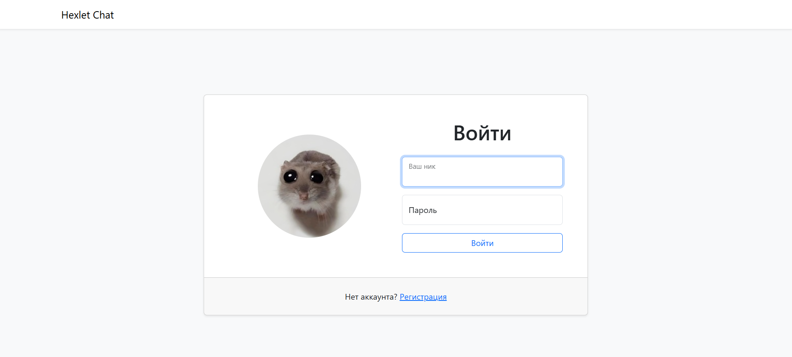
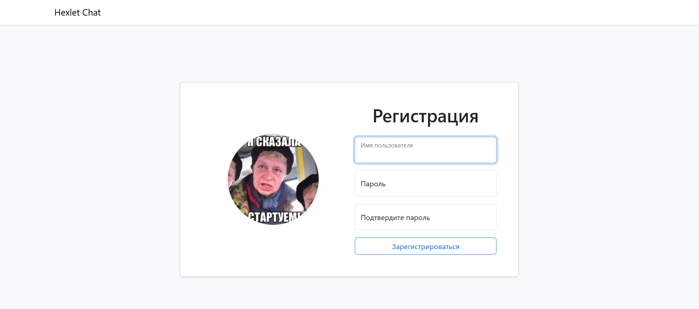
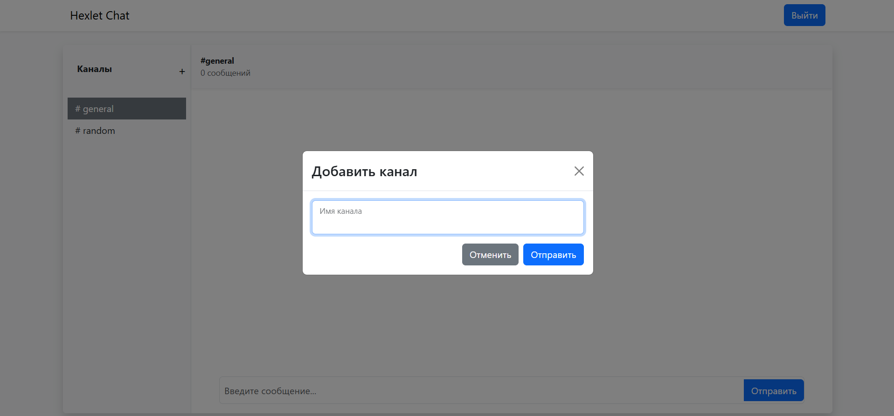
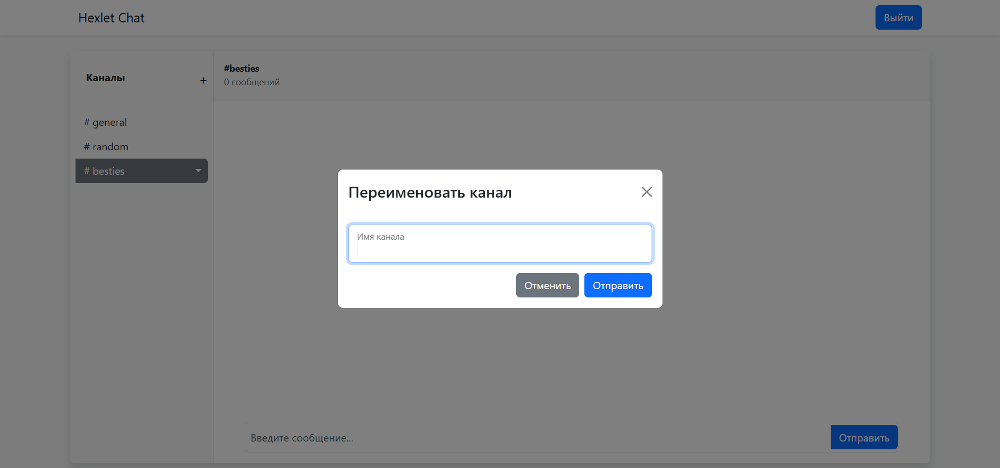
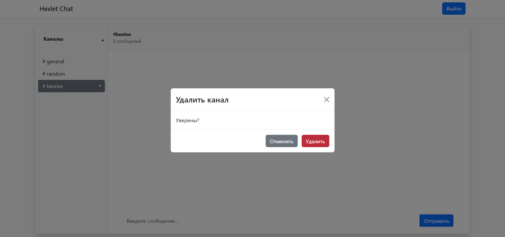
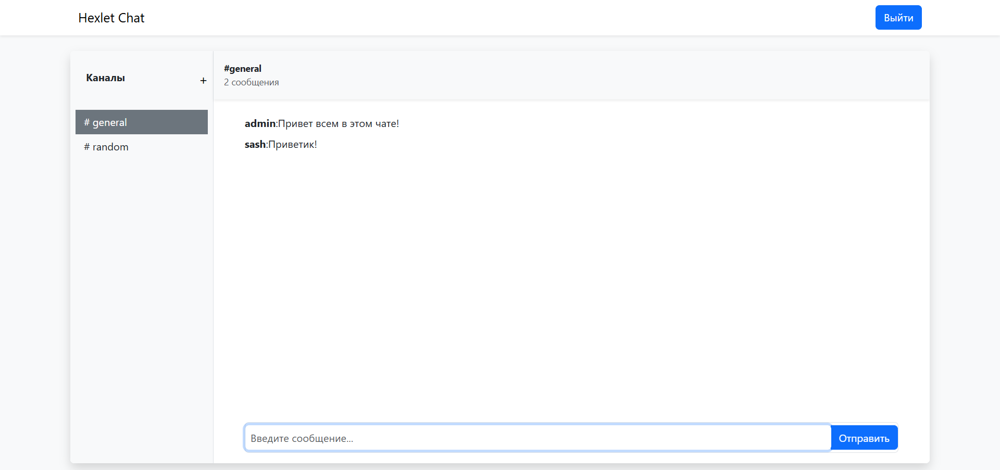

### Hexlet tests and linter status:
[](https://github.com/LittleCuteSandra/frontend-project-12/actions)

### Slack
_real-time app, an analog of Slack chat_

Deployed project https://slack-project-evl0.onrender.com

---

#### Installation
``` make install ```

#### Run

``` make develop ```

#### Build
``` make build ```

---

#### Application functionality 

Sign up new users


Authorize existing users


Create new channels


Rename added channels


Delete added channels


Write messages
